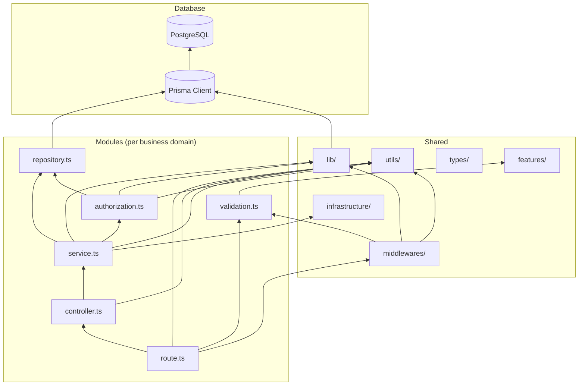

# Dependency Rules

This document codifies the architectural constraints actually followed by the current implementation. These are not aspirational rules — they are inferred from a codebase-wide analysis of imports and call patterns.

## Layer Dependency Diagram



**Reading the arrow**: "depends on / imports from". E.g. `ROUTE --> MW` means routes import middleware.

---

## Rule 1: Controllers Never Access Prisma Directly

**Observed pattern:** Every controller imports only from its service layer and utils.

| Module | Controller imports Prisma? | Imports instead |
|--------|---------------------------|-----------------|
| organization | ❌ No | `organization.service.ts` |
| project | ❌ No | `project.service.ts` |
| api-key | ❌ No | `api-key.service.ts` |
| ingestion | ❌ No | `ingestion.service.ts` |
| log-event | ❌ No | `log-event.service.ts` |
| user | ❌ No | (no service — controller returns `req.session` directly) |

**Why?** Decouples HTTP handlers from the database engine. If Prisma is swapped out (unlikely but the architectural boundary exists), only repositories change.

---

## Rule 2: Services Contain All Business Logic; No Express Types

**Observed pattern:** Service functions accept plain `string` / `Date` / custom-type arguments — never `Request` or `Response`.

```typescript
// Service signature (correct)
export const createOrganizationService = async (name: string, userId: string) => { ... }

// Not seen anywhere in the codebase:
// export const createOrganizationService = async (req: Request) => { ... }
```

Service functions:
- ✅ Validate business invariants (`name.length < 3` → `AppError`)
- ✅ Orchestrate multiple repository calls
- ✅ Call authorization helpers
- ✅ Emit realtime events / audit logs
- ❌ Never access HTTP headers, cookies, or status codes

**Why?** Services can be unit-tested without spinning up Express. Business logic is portable (could be reused in a CLI, cron job, or message handler).

---

## Rule 3: Repository Handles Persistence Only

**Observed pattern:** Repository files import `prisma` from `lib/prisma.ts` and nothing business-logic-related. Repositories do NOT import services, authorization helpers, or AppError (AppError is thrown from services/authz, not repos).

Anti-pattern NOT present:
- No `if (!entity) throw AppError(...)` inside repositories — the caller decides the error semantics
- No authorization checks in WHERE clauses unless wrapped in a semantically named function like `findOrganizationBySlugForMember` (the "ForMember" suffix signals the query is authz-aware but the authz decision itself is in `*.authorization.ts`)

Repository-only behaviors:
- Build Prisma query objects
- Return raw Prisma results (entities or null)
- Encapsulate pagination/filter composition (e.g., [log-event.query.ts](file:///c:/Users/Yuan/OneDrive/Desktop/Codes/Delok/delok-backend/src/modules/log-event/log-event.query.ts))

---

## Rule 4: Validation Happens Before Controllers (for bodies)

**Observed pattern for request bodies:** Every route with a POST/PATCH/PUT body explicitly passes through `validate(schema)` before `asyncHandler(controller)`.

```typescript
// Route pattern (universal across modules)
organizationRoute.post(
  "/",
  authMiddleware,
  validate(organizationSchema),      // ← validation runs BEFORE controller
  asyncHandler(createOrganizationController),
);
```

The `validate()` middleware uses `safeParse` and returns early **outside the error middleware** if the body is invalid. This means the controller always sees already-typed `req.body`.

**Exceptions (not using the middleware):**
- **Query params** (e.g., log-event GET): validated inside the controller via `schema.parse(req.query)` — goes through error middleware
- **Sign-up password** (Better Auth hook): validated in `hooks.before` → throws `APIError`

---

## Rule 5: Middleware Is Framework-Oriented Only

**Observed pattern:** Middleware files live in `src/middlewares/` (not inside modules) and deal with Express-specific concerns. No middleware contains business rules.

| Middleware | Responsibility | Framework-oriented? |
|-----------|---------------|---------------------|
| `authMiddleware` | Resolve session from Better Auth cookies → set `req.session` | ✅ Express `Request`/`Response`/`NextFunction` |
| `validate(schema)` | Call Zod on `req.body` → short-circuit response | ✅ Wraps Express types |
| `errorMiddleware` | Catch errors → format JSON response | ✅ Express 4-arg error handler |
| `authRateLimiter` | Path-based rate limits on auth endpoints | ✅ `express-rate-limit` wrapper |

NOT observed: no "business middleware" like `ensureOrganizationOwner` as Express middleware. Access control is always function calls inside services.

**Why?** Making authorization a function call (not middleware) means it can compose with arbitrary service-level logic (e.g., `ensureProjectMember` runs then `countLogs` + `findLogs` both run — impossible if authz is an Express middleware that runs once on entry).

---

## Rule 6: Only `lib/` and `infrastructure/` Import External SDKs

**Observed pattern:** All external service clients are constructed in `lib/` (singletons) or `infrastructure/` (adapters). Modules never import from `better-auth`, `resend`, `ws`, or `delok` SDK directly.

| SDK | Constructed in | Used via imported singleton |
|-----|---------------|-----------------------------|
| `better-auth` | `lib/auth.ts` → `auth` | `authMiddleware`, `auth.service` |
| `resend` | `lib/resend.ts` → `resend` | `lib/auth.ts` (email sending) |
| `ws` | `infrastructure/realtime/websocket.ts` → `websocket` | `server.ts` + `realtime.service.ts` |
| `delok` | `lib/delok.ts` → `delok`, `errorLogger` | authorization.ts (warn), errorMiddleware (error), auth.ts (info), services (info) |
| `@prisma/client` | `lib/prisma.ts` → `prisma` | All repository files |

**Why?** Configuration is centralized. If an API key or endpoint URL changes, you edit one file. Also, testing can mock the singleton export rather than the SDK constructor.

---

## Rule 7: Authorization Helpers Are Service-Level, Not Route-Level

**Observed pattern:** `ensureOrganizationOwner`/`ensureProjectMember`/etc. are imported by **service files**, not mounted as middleware on routes.

Compare two possible designs:

| Design A: Middleware (NOT used) | Design B: Service call (ACTUALLY used) |
|--------------------------------|---------------------------------------|
| `router.delete("/:id", ensureOwnerMW, controller)` | `service` calls `ensureOwner()` inside |
| Can't pass custom data to authz without awkward `req.params` parsing | Can compose: `ensureProjectManagementAccess` → internally calls `findProjectById` → then `ensureOrganizationOwner` |
| Authz decision is tied to HTTP layer | Authz is reusable in non-HTTP contexts |

Cross-module authorization import pattern:
```
project.service.ts → imports ensureOrganizationMember / ensureOrganizationOwner from ../organization/organization.authorization
project.authorization.ts → imports ensureOrganizationOwner from ../organization/organization.authorization
api-key.service.ts → imports ensureProjectManagementAccess from ../project/project.authorization
```

This is the only cross-module dependency pattern in the codebase, and it's intentional — access rules flow "up" from organizations to projects to resources.

---

## Rule 8: Module Files Follow Fixed Naming Conventions

Every module file follows `<domain>.<layer>.ts`.

```
organization.route.ts
organization.controller.ts
organization.service.ts
organization.repository.ts
organization.validation.ts
organization.authorization.ts   ← when present
```

Type-only files use `.type.ts` (e.g. `log-event.type.ts`), query builder helpers use `.query.ts` (e.g. `log-event.query.ts`), and routes mounted at multiple prefixes go into a `routes/` subfolder with descriptive names:

```
project/routes/organization-project.route.ts   (mounted at /api/organizations/:organizationSlug/projects; owns all project CRUD)
```

---

## Violations / Deviations Observed

Small inconsistencies found in the current implementation (documented for completeness, not judgment):

1. **API key controller imports Zod locale**: `api-key.controller.ts` has `import id from "zod/v4/locales/id.cjs"` — this import is unused in the current code and appears to be dead code. Does not follow the "no external SDK imports in controllers" spirit, though it's harmless.

2. **Query param validation not using middleware**: `log-event.controller.ts` calls `logEventQuerySchema.parse(req.query)` inside the controller. Error format on invalid query params goes through generic error middleware → surfaces as 500 "Internal Server Error" instead of a structured 400. Contrasts with body validation which uses the dedicated `validate()` middleware with a structured Zod response.
