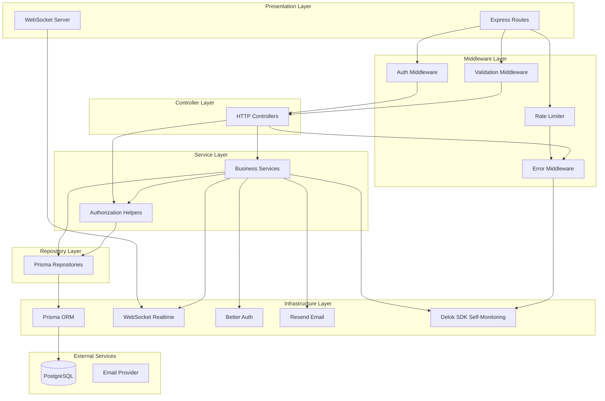

# Architecture Overview

This document describes the high-level architecture of the Delok backend, a log aggregation and monitoring platform built with Express.js and TypeScript.

## High-Level Architecture

Delok follows a **layered monolithic architecture** with clear separation of concerns. The system is organized into horizontal layers where dependencies flow downward — higher layers depend on lower layers, never the reverse.



## Layers and Responsibilities

### 1. Presentation Layer
**Purpose**: Entry points for external communication.

| Component | Responsibility |
|-----------|---------------|
| Express Routes ([app.ts](file:///c:/Users/Yuan/OneDrive/Desktop/Codes/Delok/delok-backend/src/app.ts)) | Define HTTP endpoints, mount middleware, wire request handlers |
| WebSocket Server ([websocket.ts](file:///c:/Users/Yuan/OneDrive/Desktop/Codes/Delok/delok-backend/src/infrastructure/realtime/websocket.ts)) | Accept WS connections, manage client subscriptions |

### 2. Middleware Layer
**Purpose**: Cross-cutting concerns applied before/after request processing.

| Middleware | Responsibility | Location |
|-----------|---------------|----------|
| Authentication | Verify session via Better Auth, attach `req.session` | [auth.middleware.ts](file:///c:/Users/Yuan/OneDrive/Desktop/Codes/Delok/delok-backend/src/middlewares/auth.middleware.ts) |
| Validation | Validate `req.body` against Zod schemas | [validate.middleware.ts](file:///c:/Users/Yuan/OneDrive/Desktop/Codes/Delok/delok-backend/src/middlewares/validate.middleware.ts) |
| Error Handling | Normalize errors, format JSON responses | [error.middleware.ts](file:///c:/Users/Yuan/OneDrive/Desktop/Codes/Delok/delok-backend/src/middlewares/error.middleware.ts) |
| Rate Limiting | Protect auth endpoints from abuse | [auth-rate-limit.middleware.ts](file:///c:/Users/Yuan/OneDrive/Desktop/Codes/Delok/delok-backend/src/middlewares/rate-limit/auth-rate-limit.middleware.ts) |

### 3. Controller Layer
**Purpose**: Translate HTTP requests into service calls, format responses.

Controllers are **thin** — they extract parameters from `req.params`, `req.body`, and `req.session`, then delegate to services. They never contain business logic.

Pattern example: [organization.controller.ts](file:///c:/Users/Yuan/OneDrive/Desktop/Codes/Delok/delok-backend/src/modules/organization/organization.controller.ts)

### 4. Service Layer
**Purpose**: Encapsulate business logic, orchestrate transactions, enforce authorization.

Services are the **core** of the application. They:
- Validate business rules (e.g., "organization name must be at least 3 chars")
- Call authorization helpers (`ensureOrganizationOwner`, etc.)
- Compose multiple repository operations
- Emit realtime events and audit logs

Pattern example: [organization.service.ts](file:///c:/Users/Yuan/OneDrive/Desktop/Codes/Delok/delok-backend/src/modules/organization/organization.service.ts)

### 5. Repository Layer
**Purpose**: Data persistence abstraction. Every database query lives here.

Repositories wrap Prisma operations with semantic names. They contain **zero business logic** — only query composition.

Pattern example: [organization.repository.ts](file:///c:/Users/Yuan/OneDrive/Desktop/Codes/Delok/delok-backend/src/modules/organization/organization.repository.ts)

### 6. Infrastructure Layer
**Purpose**: Integrations with external systems and low-level technical concerns.

| Component | Purpose |
|-----------|---------|
| Prisma Client ([prisma.ts](file:///c:/Users/Yuan/OneDrive/Desktop/Codes/Delok/delok-backend/src/lib/prisma.ts)) | Database adapter (PostgreSQL via `@prisma/adapter-pg`) |
| Better Auth ([auth.ts](file:///c:/Users/Yuan/OneDrive/Desktop/Codes/Delok/delok-backend/src/lib/auth.ts)) | Authentication, session management, OAuth, email flows |
| Resend ([resend.ts](file:///c:/Users/Yuan/OneDrive/Desktop/Codes/Delok/delok-backend/src/lib/resend.ts)) | Email delivery (verification, password reset) |
| Realtime Service ([realtime.service.ts](file:///c:/Users/Yuan/OneDrive/Desktop/Codes/Delok/delok-backend/src/infrastructure/realtime/realtime.service.ts)) | WebSocket event broadcasting |
| Delok SDK ([delok.ts](file:///c:/Users/Yuan/OneDrive/Desktop/Codes/Delok/delok-backend/src/lib/delok.ts)) | Self-monitoring (the backend uses its own product for logging) |

## Dependency Direction

The critical architectural invariant is **unidirectional dependencies downward**:

```
Routes → Middleware → Controllers → Services → Authorization → Repositories → Prisma → Database
                                                        ↓
                                              Infrastructure (Auth, Email, WS, SDK)
```

**Key rules** (see [dependency-rules.md](file:///c:/Users/Yuan/OneDrive/Desktop/Codes/Delok/delok-backend/docs/architecture/dependency-rules.md) for full detail):
- Controllers never import Prisma directly
- Services never access `req`/`res` (no Express types)
- Repositories contain only persistence logic
- Only `lib/` and `infrastructure/` modules may import external SDKs

## Module Organization

Business domains are organized into **modules** under `src/modules/`. Each module is self-contained with its own route, controller, service, repository, validation, and authorization files. This promotes:

- **High cohesion**: All code for "organization" lives together
- **Low coupling**: Modules interact only through service-level abstractions (typically via authorization helpers from sibling modules)
- **Discoverability**: Finding all code for a feature requires navigating one directory

See [folder-structure.md](file:///c:/Users/Yuan/OneDrive/Desktop/Codes/Delok/delok-backend/docs/architecture/folder-structure.md) for the detailed directory map.
