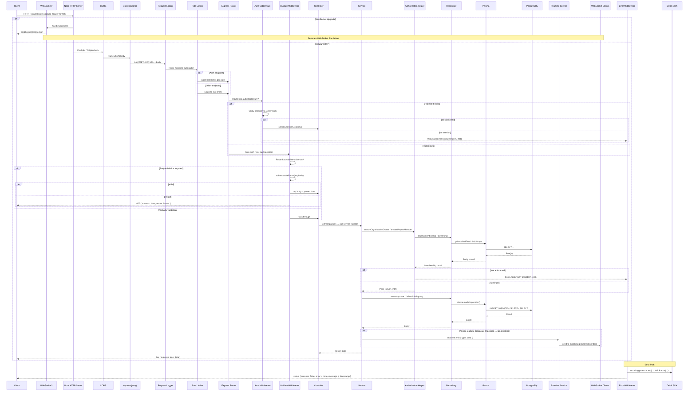
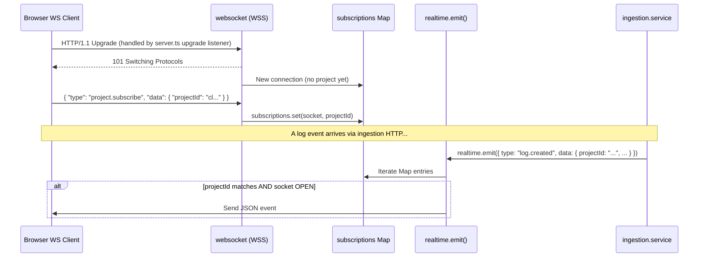

# Request Flow

This document traces the lifecycle of an HTTP request through the Delok backend, explaining where each concern (validation, auth, authz, error handling) is executed.

## Standard HTTP Request Lifecycle

## Two Authentication Flows

The backend has **two distinct authentication mechanisms** depending on the endpoint:

### Flow A: Session-Based (UI → Backend)

Used by all routes mounted under `/api/organization/*`, `/api/project/*`, `/api/user/me`, `/api/projects/*/logs`, `/api/projects/*/api-keys`, `/api/api-key/*`.

**Step-by-step:**
1. Client sends HTTP request with Better Auth cookies (from browser)
2. `authMiddleware` calls `auth.api.getSession({ headers: fromNodeHeaders(req.headers) })` — see [auth.middleware.ts](file:///c:/Users/Yuan/OneDrive/Desktop/Codes/Delok/delok-backend/src/middlewares/auth.middleware.ts#L8-L27)
3. Better Auth resolves the session cookie → looks up `Session` table → joins `User`
4. If session exists: `req.session = { user, ...session }` → proceed
5. If no session: throw `AppError("unauthorized", 401)` → caught by error middleware

### Flow B: API Key-Based (SDK → Backend)

Used exclusively by `POST /api/ingestion`.

**Step-by-step:**
1. Client (Delok SDK) sends request with `x-api-key: dlok_<raw_key>` header
2. No `authMiddleware` — ingestion route is **public** on the middleware level
3. Controller reads `req.get("x-api-key")` — see [ingestion.controller.ts](file:///c:/Users/Yuan/OneDrive/Desktop/Codes/Delok/delok-backend/src/modules/ingestion/ingestion.controller.ts#L12-L33)
4. Calls `createLogEventService(apiKey, ...)`
5. Service hashes the raw key with `sha256(rawKey)` → looks up `ApiKey` by `keyHash` — see [ingestion.service.ts](file:///c:/Users/Yuan/OneDrive/Desktop/Codes/Delok/delok-backend/src/modules/ingestion/ingestion.service.ts#L19-L65)
6. Checks: key exists AND `revokedAt` is null → continue
7. Updates `lastUsedAt` if more than 5 minutes elapsed
8. Uses the key's linked `projectId` to create the log

**Why two flows?** Session auth is for human users (security: cookies, CSRF protection). API key auth is for machines (the Delok SDK in users' apps). The two paths never mix; an endpoint uses exactly one.

## Where Validation Happens

| Location | Scope | Tool | Output on failure |
|----------|-------|------|-------------------|
| `validate(schema)` middleware | Request body **before** controller | Zod `safeParse` | Direct 400 response with Zod issues (does NOT go through error middleware) |
| Controller (query params) | `req.query` for GET endpoints | Zod `parse` inside controller | Throws → caught by `asyncHandler` → error middleware → 500 (Zod error) |
| Better Auth hook | Sign-up password | Zod schema in `hooks.before` | `APIError("BAD_REQUEST")` → Better Auth error handling |
| Service layer | Business rules (name length ≥3, key not revoked, etc.) | Manual checks + `AppError` | `throw AppError` → error middleware → formatted JSON |

**Note:** The log-event controller calls `logEventQuerySchema.parse(req.query)` (not `safeParse`), so Zod errors on query params propagate through the error middleware path rather than returning the raw Zod issues array.

## Where Authorization Happens

Authorization is **not middleware** — it's invoked explicitly inside service functions via `ensure*()` helpers.

Example flow for `DELETE /api/project/:id`:
1. Controller → `deleteProjectService(id, userId)`
2. Service → `ensureProjectManagementAccess(id, userId)` — see [project.authorization.ts](file:///c:/Users/Yuan/OneDrive/Desktop/Codes/Delok/delok-backend/src/modules/project/project.authorization.ts#L37-L50)
3. Helper → `findProjectById(id)` (repo) → get `organizationId`
4. Helper → `ensureOrganizationOwner(organizationId, userId)` — see [organization.authorization.ts](file:///c:/Users/Yuan/OneDrive/Desktop/Codes/Delok/delok-backend/src/modules/organization/organization.authorization.ts#L46-L64)
5. Helper → `findOwnerMembership(organizationId, userId)` (repo)
6. If owner: returns the membership (pass)
7. If not owner: logs with `delok.warn()` → throws `AppError("Forbidden", 403)`

This design means authorization is **co-located with business logic**: every service call makes its own authz decision. There is no declarative `@Roles(OWNER)` annotation pattern.

## Where Error Handling Happens

Errors are caught at two levels:

1. **`asyncHandler` wrapper** — wraps every async controller. Any `throw` or rejected promise inside `controller → service → repo` chain is forwarded to Express's `next(error)`. See [async-handler.ts](file:///c:/Users/Yuan/OneDrive/Desktop/Codes/Delok/delok-backend/src/utils/async-handler.ts#L3-L7).

2. **`errorMiddleware`** — mounted as the last app-level middleware. See [error.middleware.ts](file:///c:/Users/Yuan/OneDrive/Desktop/Codes/Delok/delok-backend/src/middlewares/error.middleware.ts#L31-L51):
   - If error is `AppError`: use its `statusCode`, `errorCode`, `message`
   - If generic `Error`: 500 + "Internal Server Error"
   - Logs via `errorLogger(error, req)` which calls `delok.error()` (self-monitoring)
   - Returns JSON: `{ success: false, error: { code, message }, timestamp }`

**Exception:** The validation middleware returns errors directly (not via error middleware) to preserve Zod's structured `issues` array format.

## WebSocket Message Flow

Separate from HTTP requests:

