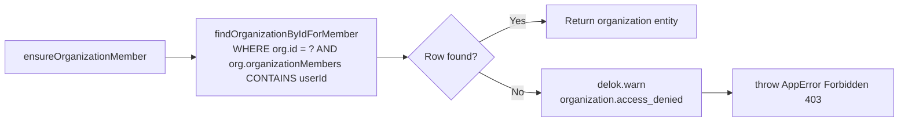
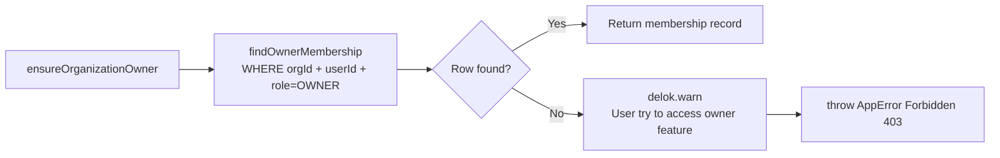
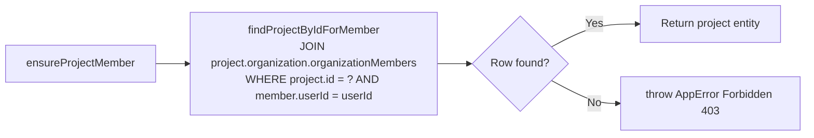
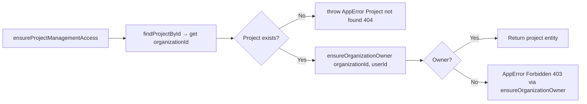

# Authorization

Authorization in Delok is a **service-layer concern**, not a middleware concern. Access-control decisions are made by calling `ensure*()` helper functions that throw `AppError("Forbidden", 403)` on failure. These helpers are always invoked from service functions before any data mutation or sensitive read.

## Role Model

The project has a **two-level role hierarchy** via the `OrganizationRole` enum ([organization.prisma](file:///c:/Users/Yuan/OneDrive/Desktop/Codes/Delok/delok-backend/prisma/schema/organization.prisma#L28-L31)):

```prisma
enum OrganizationRole {
  OWNER
  MEMBER
}
```

Roles are **per-organization**, stored in the `OrganizationMember` join table (composite PK: `[organizationId, userId]`).

| Role | Capabilities (inferred from which `ensure*` is used) |
|------|------------------------------------------------------|
| **OWNER** | Update/delete organization; create/update/delete projects; create/list/revoke/rename API keys |
| **MEMBER** | Read organization; list projects in org; read project details; read logs for any project in the org |

There is **no per-project role** concept. Project access is derived entirely from organization membership.

## Authorization Helpers

All helpers live in `*.authorization.ts` files per module.

### Organization-Level Helpers

File: [organization.authorization.ts](file:///c:/Users/Yuan/OneDrive/Desktop/Codes/Delok/delok-backend/src/modules/organization/organization.authorization.ts)

#### `ensureOrganizationMember(organizationId, userId)`

Guarantees the user has any role (OWNER or MEMBER) in the organization.



Used by:
- `getOrganizationByIdService` (read org by id)
- `getAllProjectsService` (list projects requires org membership)

#### `ensureOrganizationOwner(organizationId, userId)`

Guarantees the user has `role = OWNER` in the organization.



Used by:
- `updateOrganizationService`, `deleteOrganizationService`
- `createProjectService` (creating a project requires org ownership)
- Indirectly by `ensureProjectManagementAccess` (see below)

### Project-Level Helpers

File: [project.authorization.ts](file:///c:/Users/Yuan/OneDrive/Desktop/Codes/Delok/delok-backend/src/modules/project/project.authorization.ts)

#### `ensureProjectMember(projectId, userId)`

Guarantees the user is a member of the **parent organization** of the project. This is the base permission for reading any project data.



Used by:
- `getProjectByIdService` (read project detail)
- `getLogsByProjectIdService` (read logs requires project → org membership)

#### `ensureProjectManagementAccess(projectId, userId)`

Guarantees the user is an **OWNER** of the parent organization. Used for any destructive or management action on a project or its sub-resources (API keys).



Used by:
- `updateProjectService`, `deleteProjectService`
- `createApiKeyService` (creating API keys = management action)
- `getApiKeysByProjectIdService` (listing API keys = management action)
- `updateApiKeyNameService`, `revokeApiKeyService`

## Permission Flow Per Operation

```mermaid
graph TD
    subgraph "Organization Operations"
        ORG_READ[GET /api/organization/:id] --> OM[ensureOrganizationMember]
        ORG_LIST[GET /api/organization] --> FILTER[Repo WHERE org has member userId<br/>(query-level filter, no helper)]
        ORG_CREATE[POST /api/organization] --> OWNER_CREATION["Auto-create OWNER membership<br/>(no pre-check: user IS the creator)"]
        ORG_UPDATE[PATCH /api/organization/:id] --> OO[ensureOrganizationOwner]
        ORG_DELETE[DELETE /api/organization/:id] --> OO
    end

    subgraph "Project Operations"
        PROJ_LIST[GET /organizations/:id/projects] --> OM
        PROJ_CREATE[POST /organizations/:id/projects] --> OO
        PROJ_READ[GET /api/project/:id] --> PM[ensureProjectMember]
        PROJ_UPDATE[PATCH /api/project/:id] --> PMA[ensureProjectManagementAccess]
        PROJ_DELETE[DELETE /api/project/:id] --> PMA
    end

    subgraph "API Key Operations"
        KEY_CREATE[POST /projects/:id/api-keys] --> PMA
        KEY_LIST[GET /projects/:id/api-keys] --> PMA
        KEY_RENAME[PATCH /api/api-key/:id] --> LOAD_KEY[findApiKeyById → projectId] --> PMA
        KEY_REVOKE[PATCH /api/api-key/:id/revoke] --> LOAD_KEY2[findApiKeyById → projectId] --> PMA
    end

    subgraph "Log Operations"
        LOG_LIST[GET /projects/:id/logs] --> PM
        LOG_INGEST[POST /api/ingestion] --> APIKEY["API key auth (separate path)"]
    end
```

## Cross-Module Authorization Dependencies

Authorization composes across modules. The import graph is **directional**:

```
organization.authorization.ts
    (no cross-module authz imports)
         ↑
project.authorization.ts
    imports: ensureOrganizationOwner from ../organization/organization.authorization
         ↑
api-key.service.ts, log-event.service.ts
    imports: ensureProjectMember, ensureProjectManagementAccess from ../project/project.authorization
```

This hierarchy reflects the ownership graph: **Organization owns Projects, which own API Keys and Log Events**. Authorization always walks up to the parent's owner check.

## Authorization Bypass / Public Access

Two areas with **no authorization** (documented for completeness):

1. **User module endpoints** (`GET /api/user`, `GET /api/user/:id`, `GET /api/user/search`, `POST /api/user`, `PUT /api/user/:id`, `DELETE /api/user/:id`) — no auth middleware, no authorization helper, no ownership filter. Any caller can list, read, create, update, or delete any user. Whether this is intentional is unclear from the implementation — only `GET /api/user/me` is protected. See [dependency-rules.md violations section](file:///c:/Users/Yuan/OneDrive/Desktop/Codes/Delok/delok-backend/docs/architecture/dependency-rules.md#violations--deviations-observed).

2. **Ingestion endpoint** (`POST /api/ingestion`) — doesn't use session auth or organization-level authorization. It authenticates via API key hash, and the log is written to whichever `projectId` the key belongs to. This is by design (the Delok SDK in users' applications is the caller, not a human user).

## Error Response on Failure

Every authorization helper throws:
```
AppError(message = "Forbidden", statusCode = 403)
```

Which surfaces via error middleware as:
```json
{
  "success": false,
  "error": {
    "code": "UNKNOWN_ERROR",
    "message": "Forbidden"
  },
  "timestamp": "ISO-8601"
}
```

All denied accesses are also audit-logged via `delok.warn()` with a descriptive event payload (organization and user IDs).
