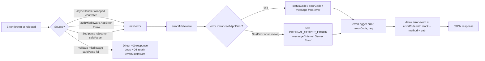

# Error Handling

Delok uses a three-part error handling system: **AppError** (custom error class), **asyncHandler** (wrapper for async controllers), and **errorMiddleware** (global error formatter + logger). This document explains how they connect.

## `AppError` — Custom Error Class

File: [utils/AppError.ts](file:///c:/Users/Yuan/OneDrive/Desktop/Codes/Delok/delok-backend/src/utils/AppError.ts)

```typescript
export class AppError extends Error {
  constructor(
    public message: string,
    public statusCode: number,
    public errorCode: string = "UNKNOWN_ERROR",
  ) {
    super(message);
    this.name = "AppError";
    Object.setPrototypeOf(this, AppError.prototype);
  }
}
```

Every domain error thrown in services/authorization constructs an `AppError` with:

- `message`: Human-readable string (sent to client if non-generic)
- `statusCode`: HTTP status code (400, 401, 403, 404, etc.)
- `errorCode`: Optional machine-readable code (defaults to `"UNKNOWN_ERROR"`). Currently only explicitly set in one place: ingestion service invalid API key → `"INVALID_API_KEY"`.

### Common AppError Usage Patterns

| Scenario                           | statusCode | errorCode               | Location                                               |
| ---------------------------------- | ---------- | ----------------------- | ------------------------------------------------------ |
| No session / bad credentials       | 401        | UNKNOWN_ERROR (default) | auth.middleware, ingestion.controller (missing header) |
| Invalid API key hash               | 401        | INVALID_API_KEY         | ingestion.service                                      |
| API key revoked                    | 401        | UNKNOWN_ERROR           | ingestion.service                                      |
| Forbidden (not member/owner)       | 403        | UNKNOWN_ERROR           | \*.authorization.ts files                              |
| Resource not found (targeted)      | 404        | UNKNOWN_ERROR           | user.service, project.authorization, api-key.service   |
| Validation failure (business rule) | 400        | UNKNOWN_ERROR           | api-key.service (already revoked)                      |

## `asyncHandler` — Promise Rejection Bridge

File: [utils/async-handler.ts](file:///c:/Users/Yuan/OneDrive/Desktop/Codes/Delok/delok-backend/src/utils/async-handler.ts)

Express's default behavior does **not** catch rejected promises from async route handlers. `asyncHandler` solves this by wrapping an async controller:

```typescript
export const asyncHandler =
  (controller: RequestHandler): RequestHandler =>
  (req, res, next) =>
    Promise.resolve(controller(req, res, next)).catch(next);
```

Without this wrapper: an `await something()` that rejects would leave the request hanging (no response sent, error logged as `UnhandledPromiseRejection`).

**Mounting pattern:** every single async controller in every route file is wrapped:

```typescript
organizationRoute.get(
  "/",
  authMiddleware,
  asyncHandler(getAllOrganizationController), // ← always wrapped
);
```

## `errorMiddleware` — Global Handler

File: [middlewares/error.middleware.ts](file:///c:/Users/Yuan/OneDrive/Desktop/Codes/Delok/delok-backend/src/middlewares/error.middleware.ts)

This is the **4-argument Express error handler** (it has the `error` as first parameter, which is how Express recognizes error middleware). It is mounted **last** in [app.ts](file:///c:/Users/Yuan/OneDrive/Desktop/Codes/Delok/delok-backend/src/app.ts#L96) (after all routes).



### Error Normalization Table

| Error kind                                            | statusCode | errorCode             | message exposed?                                                      |
| ----------------------------------------------------- | ---------- | --------------------- | --------------------------------------------------------------------- |
| `AppError("Invalid API key", 401, "INVALID_API_KEY")` | 401        | INVALID_API_KEY       | ✅ Yes                                                                |
| Generic `new Error("oops")` or any unhandled          | 500        | INTERNAL_SERVER_ERROR | ❌ No (returns generic message — internal details hidden from client) |
| Unknown non-Error thrown (string, object, etc.)       | 500        | INTERNAL_SERVER_ERROR | ❌ No                                                                 |

### Error Response Format

Success shape (returned from controllers):

```json
{ "success": true, "data": { ... } }
```

Error shape (returned from errorMiddleware — notice the different key path):

```json
{
  "success": false,
  "error": {
    "code": "INVALID_API_KEY",
    "message": "Invalid API key"
  },
  "timestamp": "2026-08-02T10:30:00.000Z"
}
```

A third error shape exists from `validate()` middleware (which short-circuits BEFORE errorMiddleware):

```json
{
  "success": false,
  "errors": [{ "code": "too_small", "message": "Required", "path": ["name"] }]
}
```

And a fourth shape from the rate limiter (uses `errorResponse` helper):

```json
{
  "success": false,
  "errorDetail": {
    "code": "RATE_LIMIT_EXCEEDED",
    "message": "Too many sign-in requests"
  },
  "timestamp": "2026-08-02T10:30:00.000Z"
}
```

**Inconsistency note (documented, not suggested change):** the project has four JSON error response shapes in current use:

- `errorMiddleware` → `error: { code, message }`
- `validate()` middleware → `errors: ZodIssue[]`
- `errorResponse()` (rate limiter) → `errorDetail: { code, message }`
- Controllers' success → `data: ...`

Each is used in a different layer, so clients need to check for each.

## Self-Monitoring: Logging Errors to Delok

The errorMiddleware calls `errorLogger(error, errorCode, req)` from [lib/delok.ts](file:///c:/Users/Yuan/OneDrive/Desktop/Codes/Delok/delok-backend/src/lib/delok.ts#L10-L26):

```typescript
export const errorLogger = async (
  error: Error,
  errorCode: string,
  req: Request,
) => {
  await delok.error({
    event: errorCode,
    message: error.message,
    payload: { method: req.method, path: req.path, stack: error.stack },
  });
};
```

This sends the error back into the Delok platform itself — the backend uses its own log ingestion product for self-monitoring. The full stack trace, HTTP method, and path are captured as payload. The `event` field is the normalized `errorCode` from the error middleware (e.g. `INTERNAL_SERVER_ERROR` for generic errors, or the AppError / Prisma errorCode for domain errors) rather than a hard-coded event name.

Additionally, authorization failures are logged via `delok.warn()` in the authorization helpers (not in errorMiddleware), and auth events (password reset sent, verification email sent/failed) are logged via `delok.info()` / `delok.error()` in the auth module config.

## `errorResponse` Utility

File: [utils/api-response.ts](file:///c:/Users/Yuan/OneDrive/Desktop/Codes/Delok/delok-backend/src/utils/api-response.ts)

Small helper used by the rate limiter. Unlike AppError + errorMiddleware, this builds and sends the response directly (the caller invokes `return errorResponse(res, ...)`).

Used for cases where the error is produced _outside_ the asyncHandler + errorMiddleware chain: `express-rate-limit`'s `handler` callback needs to respond synchronously and cannot throw into the middleware chain.

## What Reaches the Error Middleware vs. Not

| Event                                                         | Path                                                       | Handled by                                                          |
| ------------------------------------------------------------- | ---------------------------------------------------------- | ------------------------------------------------------------------- |
| `throw new AppError(...)` in controller/service/repo/authz    | asyncHandler → next(error)                                 | errorMiddleware → AppError-aware formatting                         |
| Promise rejection in controller                               | asyncHandler catch → next(error)                           | errorMiddleware → 500 generic                                       |
| `authMiddleware` throws `AppError("unauthorized", 401)`       | Async middleware throw → Express catches → errorMiddleware | errorMiddleware → AppError-aware formatting                         |
| `Zod schema.parse()` inside controller throws                 | asyncHandler → next(error)                                 | errorMiddleware → 500 generic (ZodError is not AppError)            |
| `Zod schema.safeParse()` in validate middleware fails         | Direct 400 with Zod issues                                 | **Not** errorMiddleware                                             |
| Rate limiter triggers                                         | Direct 429 via `errorResponse(res, ...)`                   | **Not** errorMiddleware                                             |
| Prisma `P2002` on `Organization.slug`                         | Promise reject → asyncHandler → errorMiddleware            | errorMiddleware → 409 `ORGANIZATION_SLUG_ALREADY_EXISTS`            |
| Prisma throws other unique constraint / foreign key violation | Promise reject → asyncHandler → errorMiddleware            | errorMiddleware → 500 generic (raw Prisma error hidden from client) |

**Current blind spot**: Zod errors from `parse()` (used in log-event query validation) and Prisma constraint violations both reach the client as generic 500 "Internal Server Error" — no diagnostic info is surfaced. The operator can see the real cause in the self-monitoring logs but the calling client cannot.
