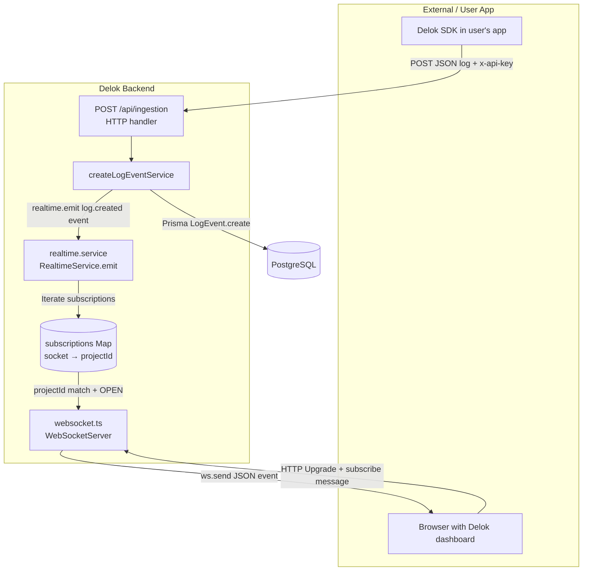

# Realtime

Delok uses a native WebSocket server (`ws` package) to broadcast newly ingested log events to subscribed browser clients in real time. The realtime subsystem lives in `src/infrastructure/realtime/` as three focused files.

## Architecture



## Files

### `event.types.ts` — Type-Safe Event Contracts

File: [event.types.ts](file:///c:/Users/Yuan/OneDrive/Desktop/Codes/Delok/delok-backend/src/infrastructure/realtime/event.types.ts)

All realtime events are declared in a single `RealtimeEventMap` interface. This creates a **discriminated union** where every event name maps to a specific payload type.

```typescript
export interface RealtimeEventMap {
  "log.created": LogCreatedEvent;
  "project.subscribe": { projectId: string };
}

export interface RealtimeEvent<TType extends RealtimeEventType = RealtimeEventType> {
  type: TType;
  data: RealtimeEventMap[TType];
}
```

Current events:

| Event | Direction | Payload | Triggered by |
|-------|-----------|---------|--------------|
| `project.subscribe` | Client → Server | `{ projectId: string }` | Browser sends when user opens a project's log view |
| `log.created` | Server → Client | Full `LogCreatedEvent` (id, projectId, env, level, event, message, occurredAt, receivedAt, payload) | Any successful ingestion to that project |

### `websocket.ts` — Connection Manager

File: [websocket.ts](file:///c:/Users/Yuan/OneDrive/Desktop/Codes/Delok/delok-backend/src/infrastructure/realtime/websocket.ts)

Responsibilities:
- Singleton `WebSocketServer` instance with `noServer: true` — the HTTP upgrade listener in [server.ts](file:///c:/Users/Yuan/OneDrive/Desktop/Codes/Delok/delok-backend/src/server.ts) manually routes upgrade events to it after session authentication
- `subscriptions: Map<WebSocket, Set<string>>` — in-memory map from each client connection to the **set of project IDs** they're subscribed to. A client can subscribe to **up to 10 projects** per socket (`MAX_SUBSCRIPTIONS_PER_SOCKET = 10`).
- `socketUsers: WeakMap<WebSocket, string>` — authenticated user ID per socket, set by the upgrade handler in `server.ts`
- `connection` handler: logs connect/disconnect, initializes heartbeat (`isAlive` + `pong` listener)
- `message` handler: parses JSON → validates against `subscribeSchema` (`project.subscribe`) or `unsubscribeSchema` (`project.unsubscribe`) via Zod `safeParse`. On `subscribe`: checks `ensureProjectMember(projectId, userId)` (403 → `FORBIDDEN` error frame if not a member), enforces limit (→ `LIMIT_EXCEEDED`), then `Set.add(projectId)`. On `unsubscribe`: `Set.delete(projectId)`. Invalid/unknown messages → `{ type: "error", error: { code, message } }` frame.
- `close`/`error` handler: removes client from both `subscriptions` and `socketUsers`
- Heartbeat: `setInterval` every 30s pings clients; terminates sockets that did not pong (detects stale connections)
- Rate limiting on WS messages: not implemented; a client can send subscribe storms up to the 10-project cap

**Authentication on WebSocket**: Upgrade is authenticated. [server.ts](file:///c:/Users/Yuan/OneDrive/Desktop/Codes/Delok/delok-backend/src/server.ts) calls `auth.api.getSession({ headers: fromNodeHeaders(request.headers) })` before `handleUpgrade`; if no session, it writes `401 Unauthorized` and destroys the socket. After upgrade, `socketUsers` stores `session.user.id` and subscription handling additionally checks `ensureProjectMember` before accepting a project ID.

### `realtime.service.ts` — Broadcast Service

File: [realtime.service.ts](file:///c:/Users/Yuan/OneDrive/Desktop/Codes/Delok/delok-backend/src/infrastructure/realtime/realtime.service.ts)

Singleton `RealtimeService` class with a single method:

```typescript
export class RealtimeService {
  emit(event: RealtimeEvent) {
    const payload = JSON.stringify(event);
    for (const [client, projectIds] of subscriptions) {
      if (client.readyState !== WebSocket.OPEN) continue;
      if (event.type === "log.created" && !projectIds.has(event.data.projectId)) continue;
      if (event.type === "project.log_count.updated" && !projectIds.has(event.data.projectId)) continue;
      try { client.send(payload); } catch { /* ignore per-client failures */ }
    }
  }
}
```

Broadcast logic:
1. Serializes the event once (not per client) for efficiency
2. Iterates the entire `subscriptions` Map from `websocket.ts`
3. Skips clients whose readyState is not `OPEN`
4. For `log.created` and `project.log_count.updated` events: only sends to clients whose subscribed `Set` contains the event's `projectId`
5. Per-client `send()` is try/caught — one dead socket does not abort broadcast to others

### Connection: server.ts Upgrade Hook

In [server.ts](file:///c:/Users/Yuan/OneDrive/Desktop/Codes/Delok/delok-backend/src/server.ts):

```typescript
server.on("upgrade", async (request, socket, head) => {
  const session = await auth.api.getSession({ headers: fromNodeHeaders(request.headers as any) });
  if (!session?.user?.id) { socket.write("HTTP/1.1 401 Unauthorized\r\n\r\n"); socket.destroy(); return; }
  websocket.handleUpgrade(request, socket, head, (client) => {
    socketUsers.set(client, session.user.id);
    (client as any).userId = session.user.id;
    websocket.emit("connection", client, request);
  });
});
```

Upgrade is rejected with 401 if no Better Auth session. No path-based WS routing — subscription is done via in-band `project.subscribe` message after connection.

## Emitter: Ingestion Service

Ingestion is the producer of realtime events.

From [ingestion.service.ts](file:///c:/Users/Yuan/OneDrive/Desktop/Codes/Delok/delok-backend/src/modules/ingestion/ingestion.service.ts):

```typescript
const createdLog = await createLogEvent(...);
realtime.emit({ type: "log.created", data: createdLog });
const logCount = await countProjectLogs(projectId);
realtime.emit({ type: "project.log_count.updated", data: { projectId, logCount } });
```

Two emits per ingestion, both **after** the DB write (sequential: DB write first, emit second):
- `log.created` — full log payload for Log Explorer views
- `project.log_count.updated` — count-only update for Projects page subscribers (avoids re-fetching)

If the DB write succeeds but broadcast fails, the log is not lost — it is returned by the paginated REST endpoint.

## Operational Endpoints (app.ts)

`app.ts:91` exposes `GET /health` (`{ status: "ok", uptime }`), `GET /readiness` (DB `SELECT 1` → `ready` or `503 db_unavailable`), and `GET /` (`{ status: "ok", service: "delok-backend" }` JSON — not an HTML test page). WebSocket connectivity is verified by completing the authenticated upgrade, not by loading `/`.

## Current Limitations (Inferred from Code)

1. **Multi-project per socket, capped at 10**: `Set<string>` with `LIMIT_EXCEEDED` error on overflow.
2. **WS authentication + per-project authorization**: Upgrade requires Better Auth session; each `project.subscribe` additionally checks `ensureProjectMember` (member/owner of parent org). Unauthenticated or unauthorized subscribes receive an `error` frame.
3. **No persistence / replay**: Only live events after subscribe are broadcast; historical data via REST.
4. **In-memory subscriptions**: Process-local `Map`/`WeakMap`; restart drops state; multi-instance not shared.
5. **Heartbeat via ws ping/pong**: 30s interval terminates stale sockets (`isAlive` flag).
6. **Per-client send is isolated**: `try/catch` around `client.send` prevents one failure from aborting others.
7. **No rate limiting on WS messages** beyond the 10-subscription cap.
