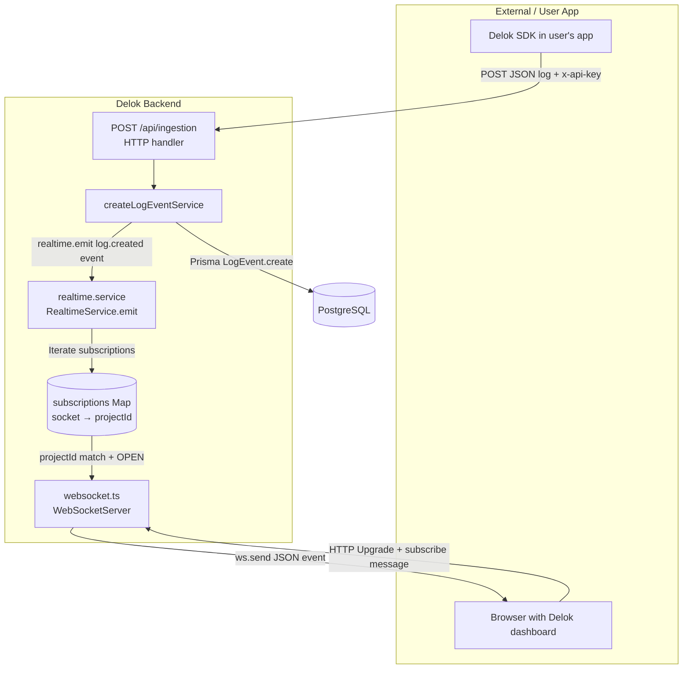

# Realtime

Delok uses a native WebSocket server (`ws` package) to broadcast newly ingested log events to subscribed browser clients in real time. The realtime subsystem lives in `src/infrastructure/realtime/` as three focused files.

## Architecture



## Files

### `event.types.ts` — Type-Safe Event Contracts

File: [event.types.ts](file:///c:/Users/Yuan/OneDrive/Desktop/Codes/Delok/delok-backend/src/infrastructure/realtime/event.types.ts)

All realtime events are declared in a single `RealtimeEventMap` interface. This creates a **discriminated union** where every event name maps to a specific payload type.

```typescript
export interface RealtimeEventMap {
  "log.created": LogCreatedEvent;
  "project.subscribe": { projectId: string };
}

export interface RealtimeEvent<TType extends RealtimeEventType = RealtimeEventType> {
  type: TType;
  data: RealtimeEventMap[TType];
}
```

Current events:

| Event | Direction | Payload | Triggered by |
|-------|-----------|---------|--------------|
| `project.subscribe` | Client → Server | `{ projectId: string }` | Browser sends when user opens a project's log view |
| `log.created` | Server → Client | Full `LogCreatedEvent` (id, projectId, env, level, event, message, occurredAt, receivedAt, payload) | Any successful ingestion to that project |

### `websocket.ts` — Connection Manager

File: [websocket.ts](file:///c:/Users/Yuan/OneDrive/Desktop/Codes/Delok/delok-backend/src/infrastructure/realtime/websocket.ts)

Responsibilities:
- Singleton `WebSocketServer` instance with `noServer: true` — the HTTP upgrade listener in [server.ts](file:///c:/Users/Yuan/OneDrive/Desktop/Codes/Delok/delok-backend/src/server.ts#L13-L17) manually routes upgrade events to it
- `subscriptions: Map<WebSocket, string>` — in-memory map from each client connection to the project ID they're subscribed to. **A client can be subscribed to at most one project at a time** (value is a single string, not an array).
- `connection` handler: logs client connect/disconnect
- `message` handler: parses JSON → if `type === "project.subscribe"`, calls `subscriptions.set(socket, data.projectId)`. Invalid JSON is caught and logged as warning but does not disconnect the socket.
- `close` handler: removes client from subscriptions map

**Important**: There is **no authentication on the WebSocket connection itself**. Any client that can open a TCP connection to the WS port and send a `project.subscribe` message with a valid-looking project ID will receive all log events for that project. Authentication for WS is not implemented in the current version. Whether this is intentional is not determined from the code.

### `realtime.service.ts` — Broadcast Service

File: [realtime.service.ts](file:///c:/Users/Yuan/OneDrive/Desktop/Codes/Delok/delok-backend/src/infrastructure/realtime/realtime.service.ts)

Singleton `RealtimeService` class with a single method:

```typescript
export class RealtimeService {
  emit(event: RealtimeEvent) {
    const payload = JSON.stringify(event);
    for (const [client, projectId] of subscriptions) {
      if (client.readyState !== WebSocket.OPEN) continue;
      if (event.type === "log.created" && projectId !== event.data.projectId) continue;
      client.send(payload);
    }
  }
}
```

Broadcast logic:
1. Serializes the event once (not per client) for efficiency
2. Iterates the entire `subscriptions` Map from `websocket.ts` (direct import, coupling between the files but accepted in exchange for simplicity)
3. Skips clients whose readyState is not `OPEN` (handles half-closed sockets without crashing)
4. For `log.created` events: only sends to clients whose subscribed `projectId` matches the event's `projectId` (multicast isolation between projects)

### Connection: server.ts Upgrade Hook

In [server.ts](file:///c:/Users/Yuan/OneDrive/Desktop/Codes/Delok/delok-backend/src/server.ts#L13-L17):

```typescript
server.on("upgrade", (request, socket, head) => {
  websocket.handleUpgrade(request, socket, head, (client) => {
    websocket.emit("connection", client, request);
  });
});
```

**All** HTTP upgrade requests go to the WebSocket server. There is no path-based routing for WS (e.g., connecting to `ws://host/ws/projectId` vs root). The connection is upgraded regardless of URL, and subscription is done via the in-band message instead.

## Emitter: Ingestion Service

The *only* producer of realtime events today is the ingestion service.

From [ingestion.service.ts](file:///c:/Users/Yuan/OneDrive/Desktop/Codes/Delok/delok-backend/src/modules/ingestion/ingestion.service.ts#L59-L62):

```typescript
const createdLog = await createLogEvent(...);
realtime.emit({
  type: "log.created",
  data: createdLog,
});
```

The event is emitted **after** the log is persisted to the database (sequential: DB write first, emit second). This means:
- Any client receiving the event can trust the log exists (event ordering matches persistence)
- If the DB write succeeds but broadcast fails (e.g., socket error mid-send), the log is not lost — it will be returned by the paginated logs REST API on next page load.

## WebSocket Test Page

The root path `/` of the backend serves a small HTML page ([app.ts](file:///c:/Users/Yuan/OneDrive/Desktop/Codes/Delok/delok-backend/src/app.ts#L71-L94)) that:
- Connects to `ws://localhost:8000` via browser WebSocket API
- Logs connect/disconnect/error events to console

This is intended as a development sanity check to confirm the WS server is listening. It does not send a `project.subscribe` message, so the page will not receive any `log.created` events on its own.

## Current Limitations (Inferred from Code)

All of these are descriptions of the current implementation, not suggestions for change:

1. **Single-project subscription per socket**: The `subscriptions` Map stores `socket → projectId` (one project). To subscribe to multiple projects a client needs multiple WebSocket connections.
2. **No WS authentication**: Connecting and subscribing requires no credentials. Whether this is acceptable for the threat model is not determined from code.
3. **No persistence / replay**: A browser connecting after a log was ingested will not receive past events; only live events going forward are broadcast. Historical data is available via the paginated REST endpoint instead.
4. **In-memory only subscriptions map**: The map lives in process memory. If the backend process restarts, all clients are disconnected and must reconnect + re-subscribe. Multi-instance deployments would not share subscription state.
5. **No heartbeat / ping-pong**: There is no application-level keep-alive. Idle connections may be dropped by proxies without detection.
6. **No error handling on `client.send`**: If `send()` throws (e.g., dead socket), the error is not caught in `emit()`.
7. **No rate limiting on WebSocket messages**: A misbehaving client can send arbitrary `project.subscribe` message storms without rate restriction on the WS side.
