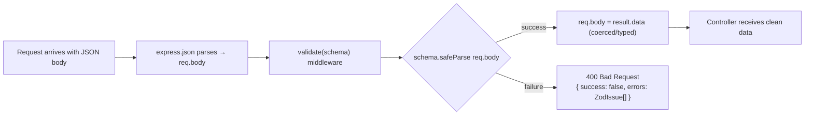

# Validation

All input validation in Delok uses **Zod v4**. Validation is applied at three distinct locations depending on the data source. This document describes the strategy, middleware, and schemas.

## Validation Library

| Library | Version | Role |
|---------|---------|------|
| `zod` | `^4.4.3` | Schema definition, parsing, safe parsing, type inference |
| (indirect) `better-auth` Zod | Built into hooks | Sign-up password validation (custom schema) |

## Validation Middleware

File: [validate.middleware.ts](file:///c:/Users/Yuan/OneDrive/Desktop/Codes/Delok/delok-backend/src/middlewares/validate.middleware.ts)

This is a **factory function** that returns an Express middleware. It validates only `req.body` (not query params or path params).

```typescript
export const validate =
  (schema: ZodType) => (req: Request, res: Response, next: NextFunction) => {
    const result = schema.safeParse(req.body);
    if (!result.success) {
      return res.status(400).json({
        success: false,
        errors: result.error.issues,   // Raw Zod issues array
      });
    }
    req.body = result.data;            // Coerced types are applied!
    next();
  };
```

Key properties:
- Uses `safeParse` (not `parse`) — returns a proper 400 response instead of throwing into error middleware
- Returns raw Zod `issues` array on failure — client sees full error detail (path, code, message)
- Replaces `req.body` with `result.data` — Zod coercions (`z.coerce.number()`, `z.coerce.date()`) take effect before the controller sees it
- **Only validates `req.body`** — query params and path params are NOT validated by this middleware

## Validation Flow for Bodies



The response on validation failure **does not** pass through the global error middleware. It returns directly from the middleware, which is why the error shape differs from the standard `{ error: { code, message } }` shape (it includes the full Zod `issues` array instead).

## Validation Flow for Query Params

Only one module uses query param validation today: `log-event`.

File: [log-event.controller.ts](file:///c:/Users/Yuan/OneDrive/Desktop/Codes/Delok/delok-backend/src/modules/log-event/log-event.controller.ts#L30)
```typescript
const query = logEventQuerySchema.parse(req.query);
```

Uses `.parse()` (not `.safeParse()`), so Zod validation errors here throw and propagate through:
1. `asyncHandler` catches → `next(error)`
2. `errorMiddleware` receives a generic ZodError → sees it's not an AppError → returns 500 "Internal Server Error"

**Trade-off**: client doesn't see structured Zod issues for invalid query params (they get a generic 500). This is inconsistent with body validation behavior. The schema *does* still enforce types and defaulting; only the error reporting differs.

## Validation Flow for Path Params

Path params (`/:id`, `/:organizationId`, `/:projectId`) are **not validated against Zod schemas** anywhere in the current implementation. Controllers call `String(req.params.foo)` and pass them to services/repositories, which pass them to Prisma. If the ID doesn't exist the query returns null and the service/authorization layer throws `AppError` (either 404 or 403 depending on the check).

**Inferred design choice**: Prisma DB-level filtering + existence checks in services replace explicit param validation.

## Schema Inventory by Module

| Schema | File | Validates | Fields |
|--------|------|-----------|--------|
| `organizationSchema` | [organization.validation.ts](file:///c:/Users/Yuan/OneDrive/Desktop/Codes/Delok/delok-backend/src/modules/organization/organization.validation.ts) | Organization create/update body | `name`: string, trimmed, 3–100 chars |
| `projectSchema` | [project.validaton.ts](file:///c:/Users/Yuan/OneDrive/Desktop/Codes/Delok/delok-backend/src/modules/project/project.validaton.ts) | Project create/update body | `name`: string, trimmed, 3–100 chars |
| `ApiKeySchema` | [api-key.validation.ts](file:///c:/Users/Yuan/OneDrive/Desktop/Codes/Delok/delok-backend/src/modules/api-key/api-key.validation.ts) | API key create/rename body | `name`: string, 3–100 chars |
| `createLogEventSchema` | [ingestion.validation.ts](file:///c:/Users/Yuan/OneDrive/Desktop/Codes/Delok/delok-backend/src/modules/ingestion/ingestion.validation.ts) | Ingestion POST body | `environment` (non-empty), `level` (non-empty), `event` (non-empty), `message?`, `occurredAt` (coerced to Date), `payload?` |
| `logEventQuerySchema` | [log-event.validation.ts](file:///c:/Users/Yuan/OneDrive/Desktop/Codes/Delok/delok-backend/src/modules/log-event/log-event.validation.ts) | Log GET query params | `page` (coerce int ≥1, default 1), `limit` (coerce int 1–100, default 50), `level?`, `environment?`, `from?` (coerce date), `to?` (coerce date), `search?` |
| `passwordSchema` | [features/auth/auth.schema.ts](file:///c:/Users/Yuan/OneDrive/Desktop/Codes/Delok/delok-backend/src/features/auth/auth.schema.ts) | Sign-up password (Better Auth hook) | 8–128 chars + uppercase + lowercase + number + special char |

## Validation Strategy Summary

**What's validated**:
- ✅ All POST/PATCH/PUT request bodies that have fields (except some custom paths like `/api/auth/*` which is Better Auth internal)
- ✅ Ingestion log event payloads (rigorously: required fields + type coercion on dates)
- ✅ Log listing query parameters (pagination, filtering, date ranges) via Zod parse
- ✅ Sign-up passwords (via Better Auth hook + dedicated schema)

**What's NOT validated** (as of current implementation):
- ❌ Path parameters (`/:id`, etc.) — existence is checked by service/authz queries, but format/type is not enforced via Zod
- ❌ Query parameters outside `log-event` module — no other module currently exposes query-parameter GET endpoints (ingestion is POST; org/project GETs take no query params)
- ❌ Session object shape on `req.session` — typed as `any` in [express.d.ts](file:///c:/Users/Yuan/OneDrive/Desktop/Codes/Delok/delok-backend/src/types/express.d.ts)
- ❌ x-api-key header format (the ingestion controller checks for existence but not the `dlok_` prefix before hashing)

## Type Pattern

Every validation file exports both the schema and its inferred TypeScript type for reuse in services/repos:

```typescript
export const createLogEventSchema = z.object({ ... });
export type LogEvent = z.infer<typeof createLogEventSchema>;
```

Services import the `type` (not the schema) to avoid coupling to Zod at the service layer.
