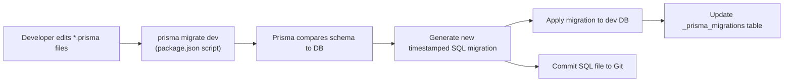

# Migrations

Delok uses **Prisma Migrate** as its migration engine against PostgreSQL. Migrations are SQL files generated from Prisma schema changes and committed to the repository.

## Migration Strategy



### Commands (from package.json)

| Command | Effect | When to run |
|---------|--------|-------------|
| `npm run prisma:generate` | Regenerate TypeScript Prisma Client at `src/generated/prisma/` | After any `.prisma` schema change, or after cloning the repo |
| `npm run prisma:migrate` | Run `prisma migrate dev` — create/apply migrations against the dev DB | Iterative development: after changing schema |

**Both commands** point to the multi-schema root: `--schema prisma/schema/schema.prisma` (the merge point of all domain `.prisma` files).

## Migration Storage and Configuration

### Config: [prisma.config.ts](file:///c:/Users/Yuan/OneDrive/Desktop/Codes/Delok/delok-backend/prisma.config.ts)

```typescript
export default defineConfig({
  schema: "prisma/schema",       // ← multi-schema: use FOLDER, not single file
  migrations: { path: "prisma/migrations" },
  datasource: { url: process.env["DATABASE_URL"] },
});
```

Multi-schema support (Prisma 7) means: instead of one `schema.prisma`, Prisma loads all `*.prisma` files in the `prisma/schema/` folder and merges them before generation/migration.

### Lockfile: [prisma/migrations/migration_lock.toml](file:///c:/Users/Yuan/OneDrive/Desktop/Codes/Delok/delok-backend/prisma/migrations/migration_lock.toml)

```toml
provider = "postgresql"
```

Lockfile is Prisma-managed. Committed to Git to ensure the same provider is used across environments. Prevents accidental provider switches (e.g., PostgreSQL → SQLite would break the migrations).

### Prisma Client Output

From [schema.prisma](file:///c:/Users/Yuan/OneDrive/Desktop/Codes/Delok/delok-backend/prisma/schema/schema.prisma):
```prisma
generator client {
  provider = "prisma-client"
  output   = "../../src/generated/prisma"
}
```

The Prisma Client is generated into **`src/generated/prisma/`**, which is imported by `lib/prisma.ts` as:
```typescript
import { PrismaClient } from "../generated/prisma/client";
```

Generated files are likely gitignored (standard practice). Regenerate on new clones via `prisma:generate`.

## Migration History (Inferred from Timestamps)

Migrations in `prisma/migrations/` are applied in timestamp order. Each is a folder named `<timestamp>_<slug>` containing `migration.sql`.

| # | Timestamp | Slug | What it did (inferred from name and later schema state) |
|---|-----------|------|---------------------------------------------------------|
| 1 | 20260629143255 | `init_user` | Created initial `User` table (name, email only; PascalCase table name `"User"`; no `emailVerified`, no `image`). Added unique index on `email`. |
| 2 | 20260702071002 | `better_auth` | **Dropped** old PascalCase `"User"` table and recreated as snake_case `"user"` (matched Better Auth's expected table names). Added `emailVerified BOOLEAN DEFAULT false`, `image TEXT`. Created Better Auth tables: `session`, `account`, `verification` with FKs to `user`. **Data loss warning**: dropped User table; this was safe only because DB was empty at the time. (Indicates adoption of Better Auth required aligning the schema to its conventions.) |
| 3 | 20260709041024 | `add_organization_project` | Added `Organization`, `OrganizationMember`, `Project` tables, first version of the mapping tables. |
| 4 | 20260709042347 | `add_organization_project` | (Duplicate slug) Second pass — likely fixed relations or added `ApiKey` model. The back-to-back 13-minute difference suggests the first attempt at the org/project schema was incomplete and migrated again quickly. |
| 5 | 20260710075237 | `rename_mapping_table` | Renamed join tables to match final naming — `@@map("organization_member")` etc. (consolidation of naming convention: snake_case DB tables, PascalCase Prisma model names). |
| 6 | 20260711061753 | `added_default_role` | Added `DEFAULT MEMBER` to `organization_member.role` column so new membership rows default to MEMBER unless specified. |
| 7 | 20260711065707 | `added_ondelete_cascade_for_every_model` | Applied `ON DELETE CASCADE` / `ON DELETE SET NULL` to **all** FK constraints. Before this migration, FKs likely defaulted to Restrict/NoAction, so deleting a user/org/project would fail with FK violation if child rows existed. |
| 8 | 20260714041918 | `add_log_event_model` | Introduced `LogEvent` model (initial version, schema evolved shortly after). |
| 9 | 20260714081526 | `update_log_event_model` | First refinement pass on LogEvent (adjusted columns or types). |
| 10 | 20260714081715 | `update_log_event_model` | Second LogEvent refinement only 2 minutes after the prior — likely the prior migration was generated against stale Prisma state or had a missing field/index. |
| 11 | 20260718052214 | `add_organization_role_enum` | Created the native PostgreSQL enum `OrganizationRole` with values `OWNER, MEMBER` and migrated `organization_member.role` column from varchar/text to the native enum type. (Earlier migrations used text/implicit enum; native Postgres enum gives better type safety and storage.) |
| 12 | 20260719120658 | `update_log_event_ondelete` | Adjusted `LogEvent.projectId` FK delete rule to Cascade (or corrected any missing FK). Ensures log events are cleaned up when their project is deleted. |
| 13 | 20260720164220 | `add_revoked_at_to_api_key` | Added `revokedAt DateTime?` column to `api_key` table for soft-delete of API keys. Ingestion flow now checks this column. |
| 14 | 20260722140759 | `harden_api_key_model` | Final ApiKey hardening — added `@@unique([keyHash])`, `keyPrefix`, `lastUsedAt DateTime?`, `createdById FK → User ON DELETE SET NULL`, and extra indexes (`projectId`, `createdById`) for the ApiKey model as it neared production use. |

## Development Workflow: Adding a Schema Change

1. **Edit the correct domain `.prisma` file.**
   - Auth/user → `auth.prisma`
   - Orgs → `organization.prisma`
   - Projects/ApiKeys → `project.prisma`
   - Logging → `log-event.prisma`
   - New generator/datasource options → `schema.prisma`
2. **Run `npm run prisma:migrate`** (calls `prisma migrate dev`).
   - Prisma diffs the merged schema against the dev DB
   - Creates `<new-timestamp>_<slug>/migration.sql` in `prisma/migrations/`
   - Applies the migration to the dev DB
   - Regenerates Prisma Client (types update)
3. **Inspect the generated SQL.** Prisma's generated SQL may not be optimal for every rename/data-move. Occasionally it proposes destructive operations (see migration #2 dropping `User` table). In development with empty DB this is fine; for migrations that will run against production data, you may need to edit the SQL file to:
   - Add `UPDATE` statements that backfill new columns
   - Use `ALTER TABLE ... RENAME` instead of drop+create
   - Add concurrency-safe operations (CREATE INDEX CONCURRENTLY etc.)
4. **Commit the migration folder to Git.** The SQL file is the source of truth for all environments.

## Production Deployment (Inferred Conventions)

The project does not declare an explicit `prisma migrate deploy` script, but standard Prisma practice is:
- Dev/staging: `prisma migrate dev` (interactive, creates migrations, resets if needed)
- Production: `prisma migrate deploy` (non-interactive, applies pending migrations in order, no client generation, no reset)

You would add a deploy-time step (CI/CD) that runs `prisma migrate deploy` before releasing new application code. This uses the committed `migration.sql` files and the `_prisma_migrations` tracking table in the target DB.

## Resetting the Development Database

Prisma Migrate supports `prisma migrate reset` (not scripted today — you would add it to package.json or run via `npx`). This drops all tables and replays migrations from scratch. Useful when a migration is edited after being applied or when seed data gets corrupted.

## Data Seeding

Unable to determine from current implementation:
- No `prisma/seed.ts` or seed script in package.json exists
- No seed data configuration in prisma.config.ts
- If seeding is needed, standard Prisma pattern is `prisma/seed.ts` + `"prisma": {"seed": "tsx prisma/seed.ts"}` in package.json
